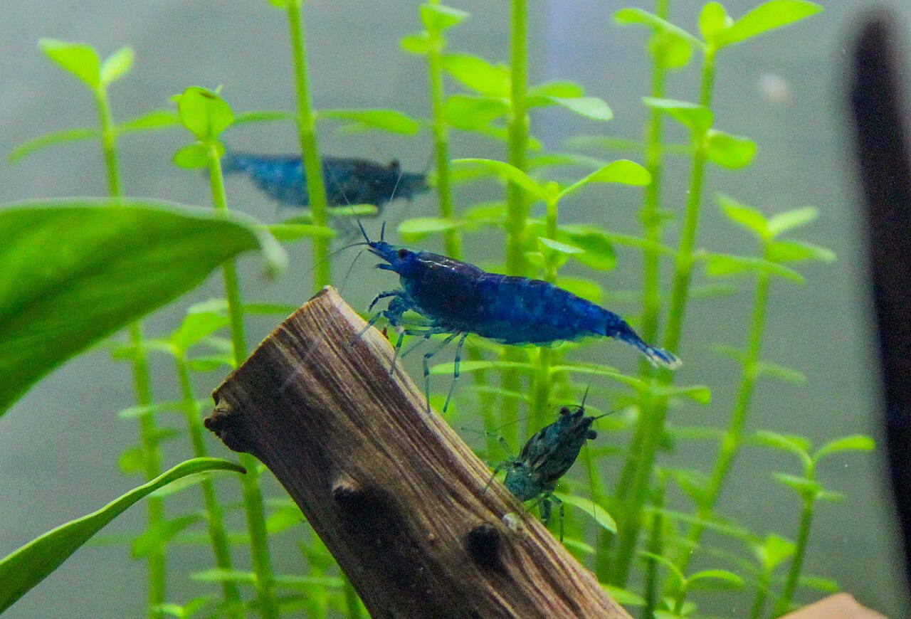
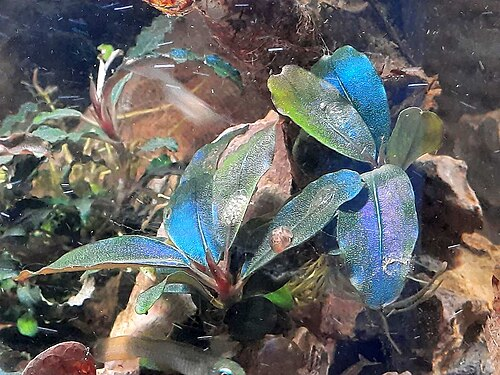
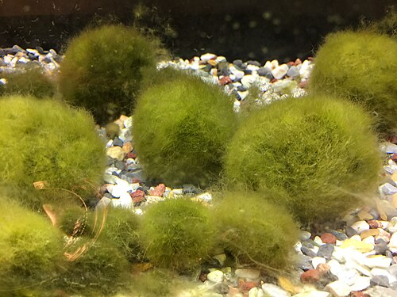
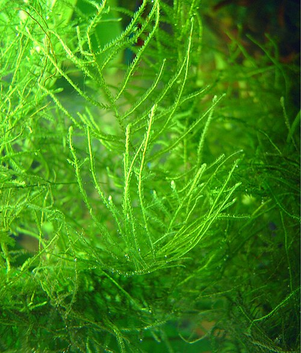
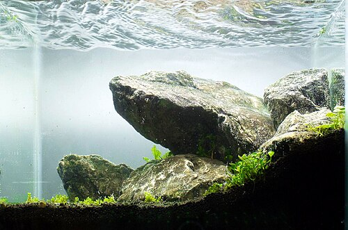

# Tank Talks — Freshwater Aquarium Blog

Source: https://tanktalks.sdfkjh.com/

colony of 12 → 60

Featured · Shrimp

# Why your Neocaridina colony stopped growing.

A healthy cherry shrimp colony grows like a slow-motion explosion. When yours just sits there — same dozen shrimp, month after month — it's almost always one of five fixable things.

[Read more →](articles/cherry-shrimp-breeding-colony-not-growing.html)

Published · May 9, 2026 Tank 03 · Planted shrimp Reading · 7 min

Trending TikTok

[#aquarium](https://www.tiktok.com/tag/aquarium) [#fishkeeping](https://www.tiktok.com/tag/fishkeeping)

· Reddit Hot

[r/Aquariums](https://www.reddit.com/r/Aquariums/hot/) [r/shrimptank](https://www.reddit.com/r/shrimptank/hot/)

· YouTube Rising

[#aquascaping](https://www.youtube.com/hashtag/aquascaping)

## Start here

↓ the basics [All reference data →](tools.html)

[

Cycling the tank

### Ammonia & nitrite levels

What "cycled" actually means — the thresholds fish can tolerate during cycling, why nitrite kills more fish than ammonia does, and the salt trick that protects them through the spike.

](tools.html#epa-ammonia)[

Water parameters

### Safe nitrate ranges

What shrimp, plant, and community-fish keepers actually target — and where the federal drinking-water number fits in.

](tools.html#epa-nitrate)[

Quarantine & decon

### Treating new plants

Freeze, boil, bleach, vinegar — kill snails, leeches, and hitchhikers before they reach your main tank.

](tools.html#usfws-decon)[

Don't dump

### Releasing tank life

Why you can't release aquarium fish or plants — and where to report invasives if you spot them.

](tools.html#usgs-invasive)

## This week's reads

↓ this week [All articles →](articles/index.html)

[

★ new 

Shrimp · 6 min

### How to acclimate new shrimp: the drip method, without overcomplicating it

You spent $40 on shrimp. They arrived alive. The next two hours decide how many are still alive next week.

](articles/shrimp-acclimation-drip-method.html)[

Plants · 7 min

### Bucephalandra: the beginner's guide to keeping "buce" alive

I killed my first three. Drowned them in CO2, baked them under a too-strong light, and — the fatal mistake — buried the rhizome.

](articles/bucephalandra-keeping-buce-alive.html)[

Fish · 6 min

### Best nano fish for a 10 gallon planted tank in 2026

There are roughly fifteen species commonly recommended. Most are fine. A few really shouldn't be in a tank this size.

](articles/best-nano-fish-10-gallon-planted-tank-2026.html)

## More from the tanks

↓ keep going [All articles →](articles/index.html)

[

★ classic 

Shrimp · 6 min

### Marimo moss balls: why every shrimp tank needs one

A clump of slow-spinning algae is a more useful tankmate than most fish. Biofilm grazing, gentle infusoria nursery, the only "plant" that survives most beginners.

](articles/marimo-moss-balls-shrimp-tank.html)[

Plants · 5 min

### Java moss vs Christmas moss — which is actually better?

Christmas moss looks better. Java moss survives more. The honest tradeoff for shrimp tanks, hardscape attachment, and slow-grow vs no-grow setups.

](articles/java-moss-vs-christmas-moss.html)[

experiment 

Experiment · 8 min

### How I finally cracked nitrate control — 6 months in my 40 gallon

High nitrates were killing plants and stressing rasboras for months. I tried everything wrong before I tried the right things — including $200 of nitrate-removing media that didn't work.

](articles/nitrate-control-40-gallon.html)

## Common problems

↓ if something's wrong [All 19 troubleshooting answers →](troubleshooting.html)

[

Fish gasping at the surface?

Test nitrite first — brown blood disease moves faster than ammonia toxicity or low oxygen. 50% water change, dose salt if your stocking allows.

Read the fix →

](troubleshooting.html#q-gasping)[

Nitrite test reading something?

In a cycled tank, nitrite is always 0. Anything detectable = water change + look for overfeeding, dead fish, or antibacterial dosing.

Read the fix →

](troubleshooting.html#q-nitrite-high)[

Water turned cloudy overnight?

New tank = bacterial bloom, harmless, clears in days. Green = phytoplankton, cut light. Brown = tannins or substrate, usually fine.

Read the fix →

](troubleshooting.html#q-cloudy)[

Cherry shrimp colony not growing?

Almost always one of five things — TDS, nitrate, copper, food, or temperature. Diagnose in order; the article walks all five.

Read the fix →

](troubleshooting.html#q-colony-stalled)[

Plants slowly dying off?

Light hours first — cap at 8. Then read the fast-growing stems for visual cues. Don't dose a nutrient bottle without knowing which deficiency.

Read the fix →

](troubleshooting.html#q-plants-dying)[

Algae taking over the tank?

Algae diagnoses the problem; killing it doesn't fix it. Cut light, raise plant mass, add Amanos or Nerites. Skip the algae-killer bottles.

Read the fix →

](troubleshooting.html#q-algae)
