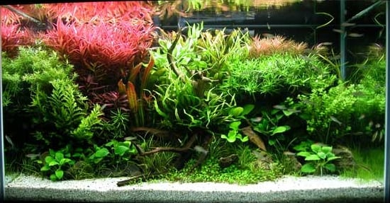
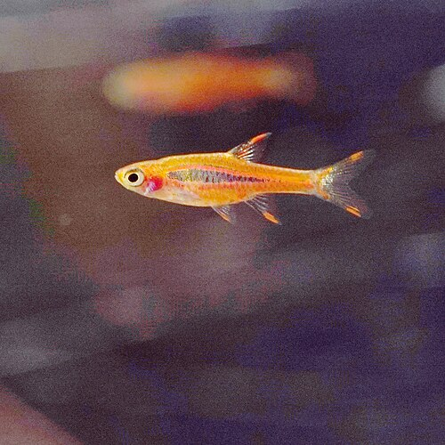
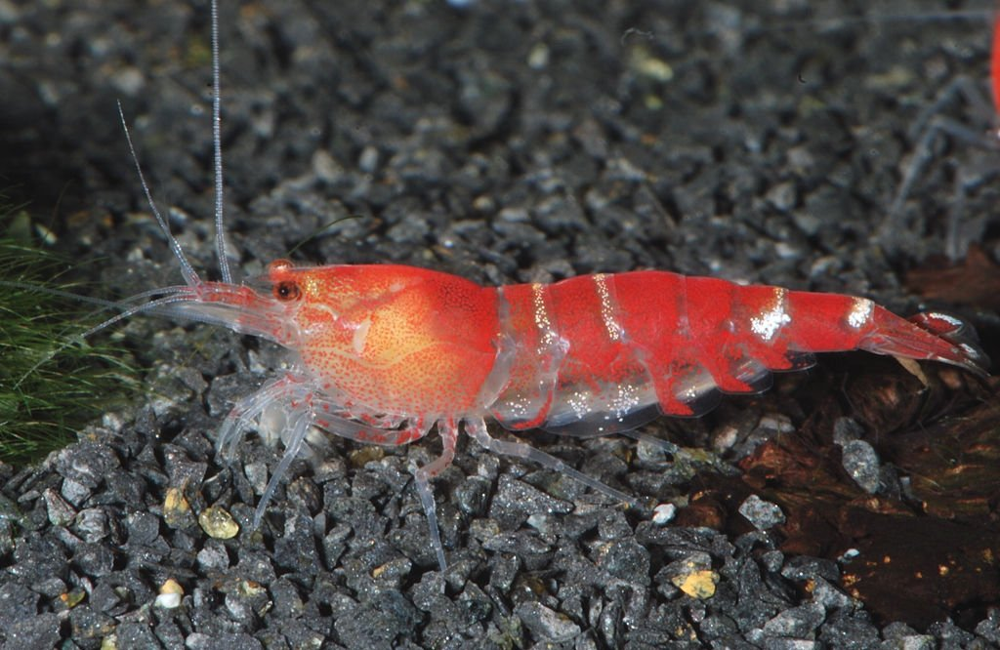
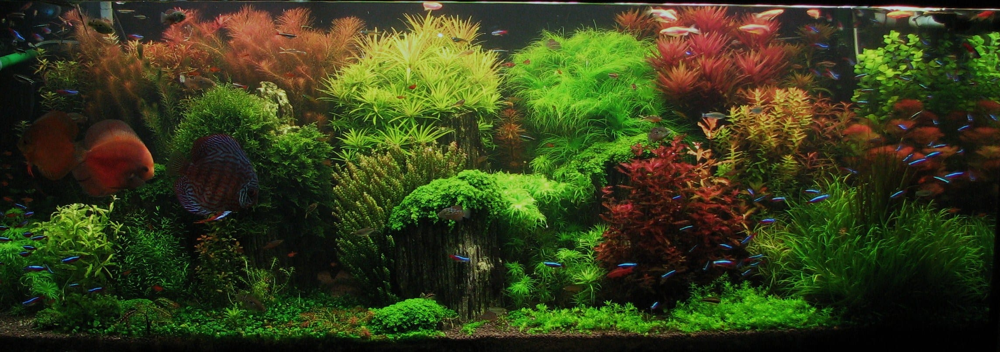

# Troubleshooting — Tank Talks

Source: https://tanktalks.sdfkjh.com/troubleshooting

Cycling & parameters

## When the chemistry has gone sideways

The high-stakes questions — fish about to die, biofilter crashing, water doing something it shouldn't.

### My fish are gasping at the surface — what's wrong?

**Check nitrite first.** Anything above 0 means nitrite toxicity (brown blood disease) — do a 50% water change immediately and dose ~1 ppt salt as protection if your stocking allows. If nitrite is 0, check ammonia, then temperature (warmer water holds less dissolved oxygen) and surface agitation. Sustained gasping with 0/0 ammonia/nitrite usually means an oxygen problem, not chemistry.

[→ Safe nitrite levels](tools.html#epa-nitrite) · [→ Safe ammonia levels](tools.html#epa-ammonia)

### My ammonia test is reading something — what do I do?

**Anything detectable means the tank isn't cycled (yet, or anymore).** Look up your tank's CCC for your pH and temperature in the EPA table — cycled-tank goal is 0 ppm, emergency is above CMC. If you're mid-cycle, expect this for 1–3 weeks. If a cycled tank suddenly reads ammonia, look for a dead fish, recent overfeeding, or a filter that died.

[→ Safe ammonia levels](tools.html#epa-ammonia) · [→ The nitrogen cycle, properly explained](articles/nitrogen-cycle-properly-explained.html)

### My nitrite test is reading something — what do I do?

**In a cycled tank, this should always be 0.** Anything detectable = water change plus look for the cause: recent overfeeding, a dead fish you missed, antibacterial dosing, substrate disturbance. If mid-cycle, you're in the nitrite stage — expect this for 1–2 weeks, dose salt as protection if your stocking allows.

[→ Safe nitrite levels](tools.html#epa-nitrite)

### My nitrate is high — how do I bring it down?

**Water changes are the only thing that reliably works.** A 50% change drops nitrate by roughly 50%; nothing in a bottle does this without trade-offs. Long-term: heavy plant load with fast-growers (hornwort, wisteria), reduce feeding, increase substrate cleaning. The article below walks through 6 months of dialing a 40-gallon down from 80 ppm to 10.

[→ How I finally cracked nitrate control](articles/nitrate-control-40-gallon.html) · [→ Safe nitrate ranges](tools.html#epa-nitrate)

### My water is cloudy — what's wrong?

Three causes. **White/grey cloudy in a new tank** (3 weeks to 2 months old) is a bacterial bloom — harmless, clears in 3–7 days, do nothing. **Green cloudy** is a phytoplankton bloom — cut light to 6 hours, raise plant density. **Brown cloudy** is usually tannins from driftwood (harmless, fades over weeks) or settled substrate (clears in hours).

### My fish have brown or tan gills — what does that mean?

**Brown blood disease — nitrite toxicity.** Nitrite outcompetes oxygen on hemoglobin, blood goes brown. Test nitrite immediately, do a 50% water change, dose ~1 ppt salt if your stocking allows (skip if you have Caridina shrimp, corydoras, or salt-sensitive plants). Usually happens during cycling, but can also mean a crashed biofilter in an established tank.

[→ Safe nitrite levels](tools.html#epa-nitrite)

Stocking & compatibility

## What goes with what

The "can I keep X with Y?" questions every new keeper asks, with direct answers about what works and what the shop oversold you.

### What fish can I keep in a 10-gallon planted tank?

**Short answer:** a small school of chili rasboras, sparkling gouramis as a centerpiece pair, or a single Betta plus cherry shrimp. Avoid: anything marketed as "community" without specifics, goldfish (no — they grow), most barbs, anything over ~2 inches. The full breakdown of what works and what shops oversell is in the article below.

[→ Best nano fish for a 10 gallon planted tank in 2026](articles/best-nano-fish-10-gallon-planted-tank-2026.html)

### Can I keep fish with cherry shrimp?

Yes, but the fish you pick decides whether you have a colony or expensive snacks. **Safe**: chili rasboras, pygmy corydoras, otocinclus, sparkling gouramis. **Unsafe**: anything bigger than a chili rasbora, anything that eats invertebrates (loaches, most gouramis, dwarf cichlids, bettas — even calm ones eventually). Babies are at most risk; even a "shrimp-safe" fish picks off the smallest. Heavy plant cover helps.

[→ Nano fish picks](articles/best-nano-fish-10-gallon-planted-tank-2026.html) · [→ Why your cherry shrimp colony stopped growing](articles/cherry-shrimp-breeding-colony-not-growing.html)

### How many fish should a schooling species have?

**Real schooling minimum is six.** Most retail signage says "groups of 3–4" — that's not a school, that's three stressed individuals that will hide all day. Six is the floor; eight to ten is where they start behaving like the species you bought. If you can't fit six of something, pick a smaller species, not a smaller school.

### My livebearers (guppies, platies, mollies) keep dying — what's wrong?

**Livebearers are demanding, despite the marketing.** They need hard, alkaline water (pH 7.5+, GH 10+), often a touch of salt, and they breed aggressively in soft tanks until everything crashes. If your tap water is soft (most US west coast and northeast tap is), every "easy" livebearer you buy will slowly fail. Either match the species to your water, remineralize, or pick a different species.

Shrimp-specific

## Cherry, Crystal, and the math of a colony

Shrimp are the editorial center of gravity on this site. The questions below are the ones every shrimp keeper hits, usually in the first six months.

### My cherry shrimp colony stopped growing — why?

**Almost always one of five things:** TDS too low for molting (target 200–300), nitrate above 20 ppm (chronic reproductive impairment), copper exposure (from medication or tap), insufficient food (yes — too clean a tank is the most common cause), or temperature too cold (need 72°F+ for active breeding). The article walks through diagnosing all five in order.

[→ Why your cherry shrimp colony stopped growing](articles/cherry-shrimp-breeding-colony-not-growing.html)

### How do I add new shrimp to my tank without killing them?

**Drip acclimate for 2–3 hours minimum.** Not float-the-bag (useless for chemistry), not dump-and-hope (osmotic shock kills them in days). Tube and valve from your tank to a container, 2–4 drops per second, double the volume, then double it again. The article has the full setup plus the mistakes that wasted my first $40 of shrimp.

[→ The drip method, without overcomplicating it](articles/shrimp-acclimation-drip-method.html)

### Cherry shrimp vs Crystal shrimp — which is easier?

**Cherry (Neocaridina) every time, for a first colony.** Crystal/Caridina need RO water plus a remineralizer, active substrate (lowers KH), pH 6.0–6.8, TDS 100–150, no copper, no fluctuation. Cherry will breed in tap water at neutral pH and forgive most beginner mistakes. The full comparison and when Crystal is worth the trouble is in the article.

[→ Neocaridina vs Caridina — your first shrimp](articles/neocaridina-vs-caridina-first-shrimp.html)

### Can I dose salt in a shrimp tank?

**Neocaridina tolerate it. Caridina don't.** Cherry, Blue Dream, and other Neocaridina handle brief salt dosing for nitrite emergencies — they're tougher than people think. Crystal, Taiwan Bees, and other Caridina do NOT tolerate it at any level — don't dose salt in a Caridina tank ever. If you're mid-cycle and have shrimp in the tank, do a 50% water change instead of dosing salt.

[→ Safe nitrite levels](tools.html#epa-nitrite)

Plants & moss

## When the greenery isn't cooperating

Plants tell you what's wrong with your tank before the fish do — but only if you read them right. The questions below are the ones we get most often about specific plants and general planted-tank trouble.

### My plants are dying — what should I check first?

**Light hours first — cap at 8 (over that you grow algae, not plants).** Then read your fast-growing stems for visual cues: **yellow lower leaves** = nitrogen/potassium, **pinholes** = potassium specifically, **transparent new growth** = iron, **stunted growth** = phosphate or CO2. Fix the deficiency, not the symptom. Don't dose a bottle of nutrients without knowing which one — over-dosing iron will crash your shrimp.

[→ How I finally cracked nitrate control](articles/nitrate-control-40-gallon.html)

### Java moss vs Christmas moss — which should I get?

**Java if you want it to survive whatever you do to it.** Christmas if you can keep it alive long enough to enjoy the better look. Christmas grows tight and branching, picture-book moss; Java grows in a tangle but doesn't die if you forget about it for a month. For first moss, get Java. For shrimp tanks specifically, get both — they prefer Christmas to graze on, but Java will save you when the Christmas inevitably stalls.

[→ Java moss vs Christmas moss — which is actually better?](articles/java-moss-vs-christmas-moss.html)

### My marimo moss ball is turning brown — what's happening?

**Three causes:** water too warm (they're cool-water — 76°F max, ideally lower), accumulated detritus on the surface (squeeze and rinse weekly in tank water), or too much light (they evolved at depth — keep them shaded or rotate so all sides get equal exposure). Brown patches recover slowly; black ones don't.

[→ Marimo moss balls: why every shrimp tank needs one](articles/marimo-moss-balls-shrimp-tank.html)

### My Bucephalandra is turning yellow or melting — what now?

**Buce melts when you change its environment too fast — or bury its rhizome.** Tie it to hardscape, never to substrate (rhizome must be exposed). Stable parameters matter more than ideal parameters — fluctuations cause melt. If a leaf already melted, leaves below the rhizome will regrow; cut the dead leaf at the rhizome with sharp scissors. The article covers the mistakes that killed my first three.

[→ Keeping "buce" alive](articles/bucephalandra-keeping-buce-alive.html)

### My tank has algae everywhere — how do I fix it?

**Algae diagnoses the problem; killing it doesn't fix it.** Cut light to 6 hours. Increase fast-growing stem plant mass. Reduce feeding. Add Amano shrimp (most effective algae crew member) or Nerite snails. Hydrogen peroxide spot-dose for hair and staghorn algae specifically. Avoid "algae killer" bottles — they all damage plants and most damage shrimp.

## Still stuck? Ask the community.

Email us at **hello@tanktalks.sdfkjh.com** with a photo, your test results, and what you've tried — we answer everything, slowly sometimes, but always.

Or hit the Reddit aquarium subs. They're large, active, and (mostly) friendly — but they're brutal to vague questions. Frame yours like this:

### How to ask so people actually help

-   **Tank size + age** — number of gallons, weeks or months running.
-   **Full parameters from a recent test** — ammonia, nitrite, nitrate, pH, GH/KH, temp. The more you list, the more seriously people take you.
-   **A clear photo of the problem** — fish, plant, water, gill, whatever the issue is. In focus, well-lit, no flash on the glass.
-   **What you've already tried** — and what you're seeing now. Don't just say "it's not working"; describe the specific change you made and what happened next.
-   **Your stocking list** — every species and how many of each. This is where most "why are my fish dying" threads turn out to be overstocking.

### Where to ask

-   [r/Aquariums](https://www.reddit.com/r/Aquariums/) — biggest, general freshwater. Good for emergencies and stocking advice.
-   [r/shrimptank](https://www.reddit.com/r/shrimptank/) — Caridina, Neocaridina, breeding, parameters. The whole shrimp-keeper world lives here.
-   [r/PlantedTank](https://www.reddit.com/r/PlantedTank/) — planted tanks, dosing, lighting, CO2, algae diagnosis.
-   [r/AquaticPlants](https://www.reddit.com/r/AquaticPlants/) — plant ID and deficiency diagnosis specifically. Smaller, more focused.
-   [r/fishkeeping](https://www.reddit.com/r/fishkeeping/) — beginner-friendly, less critical of basic questions than r/Aquariums can be.
-   [r/Goldfish](https://www.reddit.com/r/Goldfish/) — goldfish-specific. Their needs differ enough from tropical that the general subs sometimes give them wrong advice.

Last updated May 25, 2026
